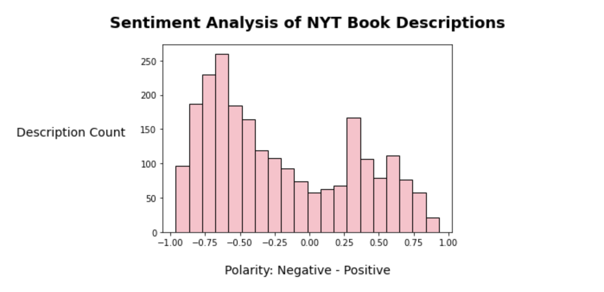

# NYT Bestsellers Textual Analysis

For this project, I did a textual analysis on a data set from Kaggle about NYT book bestsellers using Databricks. 

I used the NLTK NLP library, alongside Matplotlib to do sentimental analysis, and plot word frequency distribution, & much more.

## <a href= "https://databricks-prod-cloudfront.cloud.databricks.com/public/4027ec902e239c93eaaa8714f173bcfc/6685960649076912/983728187011459/7028871264462805/latest.html">Check out my Databricks Notebook Here</a>
